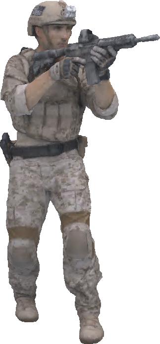
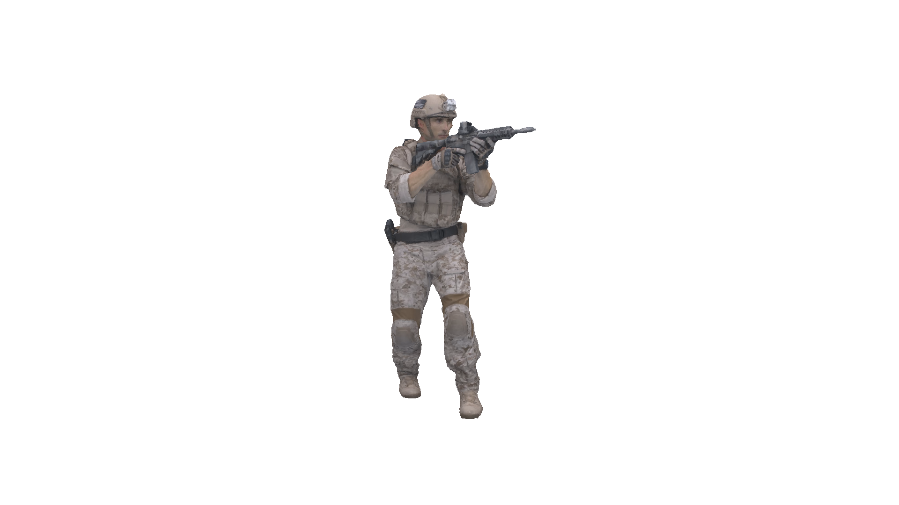
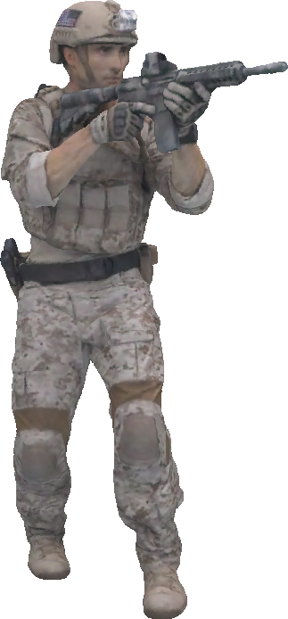

# Learned Compression of Point Cloud Geometry and Attributes in a Single Model through Multimodal Rate-Control 

[](https://arxiv.org/abs/2408.00599)


## Table of Contents

- [Overview](#overview)
- [Approach](#approach)
- [Results](#results)
- [Usage](#usage)
- [Citation](#citation)

## Overview

This repository accompanies our paper on Learned Compression of Point Cloud Geometry and Attributes in a Single Model through Multimodal Rate-Control. 
The main contribution is the usage of a joint autoencoder to compress the point cloud geometry and attributes in a single autoencoder model. 
As this would result in training an ensemble of models (one for each trade-off between rate, geometry quality and attribute quality), we propose to condition the model on the trade-off between the aformentioned triplet at training time, resulting in a single trained model. 
In contrast to the standard approach for point cloud compression, which requires separate models for geometry and attributes, as well as decoding the geometry for attribute re-projection at the sender, we believe our approach offers more flexibility and reduced encoding latency with a comparable rate-distortion trade-off.

## Approach

We consider the problem of compressing a point set $\mathcal{P} = (\mathbf{g}, \mathbf{a})$ containing a set of point locations $\mathbf{g}$, denoted geometry, and corresponding attributes $\mathbf{a}$. 

### Multimodal Conditioning

To achieve this goal, we propose an approach for conditioning a model on the tradeoff between geometry quality, attribute quality and the bitrate. To achieve this, the model is conditionend on a quality map $\mathbf{q}=[\mathbf{q}^{(G)}, \mathbf{q}^{(A)}]$ for the quality of the geometry and the attributes.

We arrive at a loss function between the quality of both modalities and the rate 

$$\mathcal{L} = \mathcal{R} + \mathcal{D}_A + \mathcal{D}_G$$

with the geometry distortion loss $\mathcal{D}_G$ and attribute loss $\mathcal{D}_A$ integrating a per-voxel loss map $\boldsymbol{\lambda}^{(G)}$ and $\boldsymbol{\lambda}^{(A)}$ respectively.

The values of the loss maps are derived through a quadratic weighting function i.e. $T_A: [0, 1] \mapsto {[\lambda_{\text{min}}, \lambda_{\text{max}}]}$ with $T_A(x) = (\lambda^A_{\text{max}} - \lambda^A_{\text{min}}) x^2 + \lambda^A_{\text{min}}$, such that $\boldsymbol{\lambda}^{(A)}_u = T_A(\mathbf{q}^{(A)}_u)$, with $u \in \mathbf{g}$.
The same mapping holds for $\boldsymbol{\lambda}^{(G)}_u$.

The Geomeetry loss $\mathcal{D}_G$ is based on the [Focal Loss](https://arxiv.org/abs/1708.02002), which has been used in [multiscale point cloud geometry compression](https://arxiv.org/abs/2011.03799):

```math
\mathcal{D}_G = - \sum_{k=0}^{K-1} \sum_{u \in \mathbf{\tilde{d}}^{(k)} } \boldsymbol{\lambda}_u^{(G, k)} (1 -\dot{\mathbf{p}}_u^{(k)} ))^{\gamma} \log(\dot{\mathbf{p}}_u^{(k)})
```

```math
\text{ with } \dot{\mathbf{p}}_u^{(k)} = 
\begin{cases}
    \mathbf{\tilde{p}}_u^{(k)} &\text{if } u \in \mathbf{g}^{(k)} \\
    1 - \mathbf{\tilde{p}}_u^{(k)}  &\text{else} \end{cases} \; ,
```


the attribute component $\mathcal{D}_A$ relying on element-wise regression

```math
\mathcal{D}_A = \sum_{u \in \mathbf{g} \cap \tilde{\mathbf{g}}} \boldsymbol{\lambda}_u^{(A)} \lVert \mathbf{a}_u - \mathbf{\tilde{a}}_u \rVert_2^2
```

### Architecture

Our model architecture consists of a single encoder/decoder which is accompanied by a condition map to encode the quality maps into the latent representation.
 

## Results

### Pareto-Fronts
Pareto-Fronts are optimized by grid-searching possible combinations between geometry and attribute quality. Thus, they are optimized per-content. 

<p float="left" style="text-align:center;">
  
  
  
  <br>
  <div style="display:inline-block; width:200px; text-align:center;">longdress</div>
  <div style="display:inline-block; width:200px; text-align:center;">soldier</div>
  <div style="display:inline-block; width:200px; text-align:center;">redandblack</div>
  <div style="display:inline-block; width:200px; text-align:center;">loot</div>
</p>

### Generalized Compression (Lossy Geometry, Lossy Attributes)
We compare against G-PCC and V-PCC for the lossy-geometry, lossy-attribute compression use case. 
For this, we select 4 configuration pairs of our model, allowing to consistently outperfom G-PCC and perform on-par with V-PCC.

<div style="text-align:center;">
  <!-- First Row of Images -->
  <div style="display:inline-block; vertical-align:top;">
    
    
    
    
  </div>
  
  <!-- Second Row of Images -->
  <div style="display:inline-block; vertical-align:top;">
    
    
    
    
  </div>

  <!-- Third Row of Images with Labels -->
  <div style="display:inline-block; vertical-align:top;">
    <div style="display:inline-block; text-align:center;">
      <br>
      <label style="display:block; width:200px;">longdress</label>
    </div>
    <div style="display:inline-block; text-align:center;">
      <br>
      <label style="display:block; width:200px;">soldier</label>
    </div>
    <div style="display:inline-block; text-align:center;">
      <br>
      <label style="display:block; width:200px;">redandblack</label>
    </div>
    <div style="display:inline-block; text-align:center;">
      <br>
      <label style="display:block; width:200px;">loot</label>
    </div>
  </div>
</div>

### Latency
On a machine with a NVIDIA RTX 4090 and AMD EPYC 7542, our model achieves significantly faster compression then G-PCC and V-PCC as well as the learning-based YOGA.
Note that the results for YOGA are obtained from the original paper on different hardware, as it is not yet open-sourced.

| Method | Enc. time | Dec. time | Model size |
| ------ | ------ | ------ | ------ | 
| G-PCC | 11.24s | 1.51s | n/a | 
| V-PCC | 57.29s | 1.76s | n/a
| YOGA | 8.15s | 3.23s | 169.5 MB
| Ours | 0.75s | 1.84s | 120.1 MB

### Visual Results
<p style="text-align:center;">
  <span style="display:inline-block; width:200px;">
    <br>
    <label>Original</label>
  </span>
  <span style="display:inline-block; width:200px;">
    <br>
    <label>G-PCC</label>
  </span>
  <span style="display:inline-block; width:200px;">
    <br>
    <label>V-PCC</label>
  </span>
  <span style="display:inline-block; width:200px;">
    <br>
    <label>Ours</label>
  </span>
</p>


## Usage


### Setup
```
# Python
python -m venv .env
python -m pip install -r requirements.txt

# Open3D
sudo apt-get install libosmesa6-dev
mkdir dependencies & cd dependencies
git clone https://github.com/isl-org/Open3D

cd Open3D
util/install_deps_ubuntu.sh

mkdir build && cd build

cmake -DENABLE_HEADLESS_RENDERING=ON \
                -DBUILD_GUI=OFF \
                -DBUILD_WEBRTC=OFF \
                -DUSE_SYSTEM_GLEW=OFF \
                -DUSE_SYSTEM_GLFW=OFF \
                ..

make -j$(nproc)
make install-pip-package

# PCQM
git clone https://github.com/MEPP-team/PCQM.git
mkdir PCQM/build && cd PCQM/build
cmake ..
make

# G-PCC
cd dependencies
git clone https://github.com/MPEGGroup/mpeg-pcc-tmc13.git
cd mpeg-pcc-tmc13
mkdir build && cd build
cmake ..
make

# V-PCC
cd dependencies
git clone https://github.com/MPEGGroup/mpeg-pcc-tmc2.git
cd mpeg-pcc-tmc2 && ./build.sh
```


### Preparing the Dataset
To prepare the dataset 

```
TODO 
```


### Training
We provide sample configurations in ./configs for training a model.

```
python train.py --config=./configs/<yourConfig>
```


### Evaluation
To rerun the evaluation, run 

```
python evaluate.py 
```

and to create the plots after evaluation, run 

```
python plot.py 
```


## Citation

If you find our work helpful, please consider citing us in your work:
```
@article{rudolph2024learnedcompressionpointcloud,
      title={Learned Compression of Point Cloud Geometry and Attributes in a Single Model through Multimodal Rate-Control}, 
      author={Michael Rudolph and Aron Riemenschneider and Amr Rizk},
      journal={arXiv preprint arXiv:2408.00599},
      year={2024},
}
```
